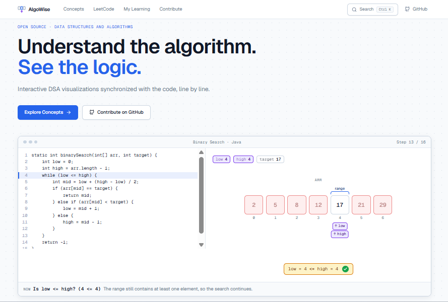
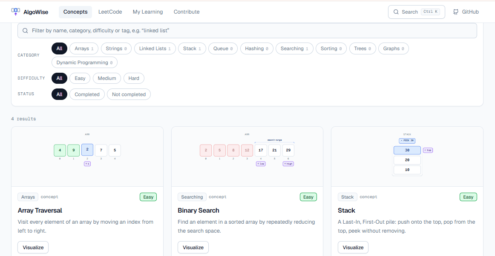
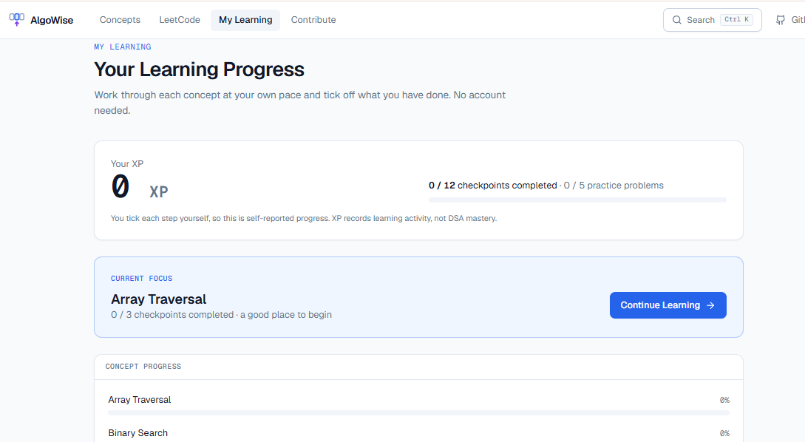

# AlgoWise

> **Understand the algorithm. See the logic.**

[](https://github.com/Vaishnavi22104/AlgoWise/actions/workflows/ci.yml)
[](LICENSE)
[](CONTRIBUTING.md)

**Live demo: [algowise-dsa.vercel.app](https://algowise-dsa.vercel.app)**

AlgoWise is an open-source platform for learning data structures and algorithms by watching the code run, line by line. The code is on the left, the data structure on the right, and a step-by-step explanation underneath. Every step highlights the executing line, updates the picture and says what just happened and why.

It is also a **framework**: a community can add one visualization at a time without touching layout, controls, the editor or the colour system.

## Project overview

AlgoWise turns an algorithm into a trace of small steps. Each step records which line of code is running, what the data looks like and a plain-English explanation. One shared renderer draws every step, so adding a visualization means writing an executor and describing its state, not building a new interface. See [docs/ARCHITECTURE.md](docs/ARCHITECTURE.md) for the full picture.

## Screenshots







## Features

- Code and visualization synchronized through a single step object (`anchor` + `state` + `explanation`)
- Java (default) and Python code for every algorithm: switch language at any time without losing your place; the animation is shared
- Monaco editor with current-line highlight (with a built-in fallback if Monaco cannot load)
- Previous, Step, Play/Pause, Reset, Slow/Normal/Fast and a scrub bar. Keyboard: `←` `→` `Space` `R`; `F` or the Focus Mode button opens a distraction-free code + visualization view in real browser fullscreen, scaled to fit with no scrolling (`Esc` exits)
- A shared colour language: blue active, orange compared, green correct, red rejected, purple pointer
- Visualization primitives: array, stack, linked list (SVG arrows), hash map, pointers, variable badges, comparison and result indicators
- Concepts and LeetCode pages with search, category / difficulty / status filters; `Ctrl+K` global search
- My Learning: self-reported checkpoints (Understand, Explore, Practice), recommended problems and XP, saved in the browser (no account needed)
- Reduced-motion support, semantic buttons, ARIA labels, visible focus
- Demo mode for talks: press `D` to get a four-stop presenter bar

### Included content

| Concepts | Problems |
| --- | --- |
| Array Traversal | Two Sum |
| Binary Search | Valid Parentheses |
| Stack | Binary Search |
| Singly Linked List | Reverse Linked List |
| | Merge Two Sorted Lists |

Problem pages contain our own full restatement of each problem (task, examples, constraints) plus our explanations, code and animations, and a link to the official statement. The text is written in our own words; we never copy the original statements.

## Getting started

```bash
git clone https://github.com/Vaishnavi22104/AlgoWise.git
cd AlgoWise
npm install
npm run dev        # http://localhost:3000
```

```bash
npm run typecheck  # TypeScript
npm run lint       # ESLint
npm run test       # Vitest: executors, registry, playback, search, progress
npm run build      # production build
```

Requires Node.js 20 or newer.

## Architecture

```text
Algorithm definition  ->  Executor  ->  Step state  ->  Renderer  ->  UI controls
 (metadata + code)       (trusted)     (per step)     (primitives)    (playback)
```

```text
core/          engine: step types, registry, validation, playback, design tokens, timing
algorithms/    concepts, one folder each (+ _template)
problems/      problem walkthroughs, one folder each
content/       manifest that registers everything
components/    UI + visualization primitives
app/           routes
docs/          contributor documentation
```

The renderer receives a `VisualizationState` and has no idea which algorithm produced it. Adding a folder and one line in `content/index.ts` is enough for an algorithm to appear in Concepts / LeetCode, search and routing (add it to `content/learning.ts` to include it in My Learning). Details: [docs/ARCHITECTURE.md](docs/ARCHITECTURE.md).

## Add your first visualization

AlgoWise is designed so that contributors do not need to understand the entire codebase.

1. Pick an algorithm.
2. `npm run create-algorithm -- my-algorithm` (or copy `algorithms/_template`).
3. Implement the execution steps.
4. Describe the visual state with the existing primitives.
5. Run the tests.
6. Open a PR.

Read [docs/ADDING-ALGORITHM.md](docs/ADDING-ALGORITHM.md), then [CONTRIBUTING.md](CONTRIBUTING.md). Look for issues labelled `good first issue`.

## Roadmap

1. **Foundation** (shipped): engine, core components, first algorithms and problems, My Learning with progress saved in the browser
2. **Community** (in progress): templates, issue system, PR workflow, more algorithms
3. **Accounts** (planned, not built): authentication, account-based progress, cross-device sync, Google/GitHub login
4. **Community learning** (planned, not built): learning history and streaks, personalized paths, study groups, shared progress, discussions

## Security

Version 1 never executes user-written code. To report a vulnerability privately, see [SECURITY.md](SECURITY.md). Each trace is generated by a trusted executor function that goes through code review. Editable code will arrive later in an isolated worker with limits.

## License

[MIT](LICENSE)
## Hacktoberfest

Hacktoberfest contributions are welcome! Pick an issue labelled `good first issue` and open a pull request.